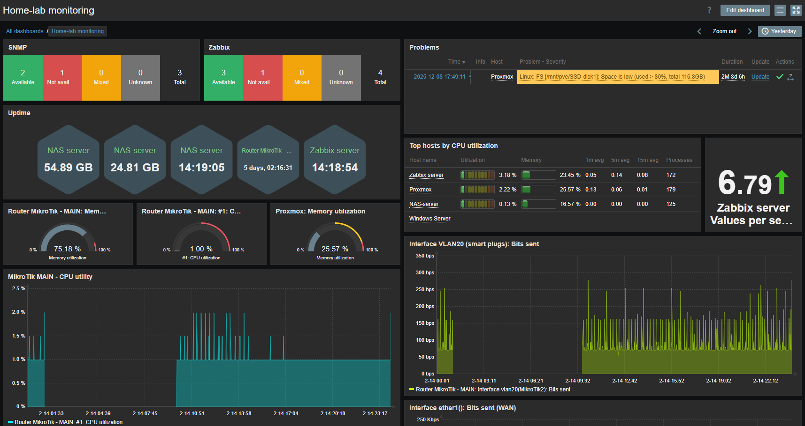

# Monitoring infrastruktury – Zabbix + SNMP

## Cel
Celem wdrożenia monitoringu było:
- monitorowanie urządzeń sieciowych (MikroTik) przez SNMP
- monitorowanie VM w środowisku Proxmox
- zbieranie metryk wydajnościowych
- konfiguracja alertów

---

## Środowisko

### Serwer monitoringu
- Zabbix Server uruchomiony jako VM w Proxmox
- System operacyjny: Linux
- Baza danych: MariaDB
- Zabbix Agent – używany dla hostów Windows

---

## Monitoring urządzeń sieciowych (SNMP)

### Konfiguracja SNMP na MikroTik
- Włączony SNMP
- Ograniczenie dostępu do adresu IP serwera Zabbix
- Konfiguracja community (SNMPv2c)

Monitorowane metryki:
- wykorzystanie CPU
- użycie pamięci
- ruch na interfejsach
- status interfejsów
- uptime urządzenia

---

## Integracja z Zabbix

### Dodanie hosta SNMP
- Typ: SNMP agent
- Wersja: SNMPv2
- Community string: MikroTik
- Template: Mikrotik by SNMP

### Elementy monitorowane:
- Ruch na interfejsie sieciowym
- Uptime hardware
- CPU utilization
- Memory utilization

---

## Monitoring VM

Dla maszyn Linux:
- instalacja i konfiguracja SNMP Agent
- monitoring:
  - CPU
  - RAM
  - swap
  - load average
  - dysk
  - procesy

Dla hosta Proxmox:
- monitoring z wykorzystaniem SNMP oraz Zabbix Agent

---

## Alertowanie

Skonfigurowane triggery:
- wysokie użycie CPU (>80%)
- brak odpowiedzi SNMP
- interfejs down
- niski poziom wolnego miejsca na dysku

Akcje:
- powiadomienia e-mail
- zmiana statusu hosta

---

### Diagram przepływu

---

## Wizualizacja

- Dashboard infrastruktury
- Wykresy ruchu sieciowego na interfejsie (bit/s)  
- Monitoring dostępności urządzeń

Przykładowy dashboard infrastruktury:

---

## Wnioski techniczne

- SNMP umożliwia centralne monitorowanie urządzeń sieciowych
- Template w Zabbix znacząco przyspiesza konfigurację
- Monitoring pozwala wykrywać problemy wydajnościowe przed awarią
- Segmentacja sieci zwiększa bezpieczeństwo SNMP